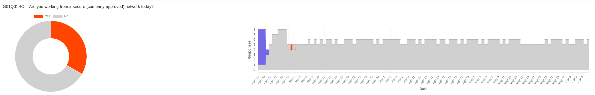
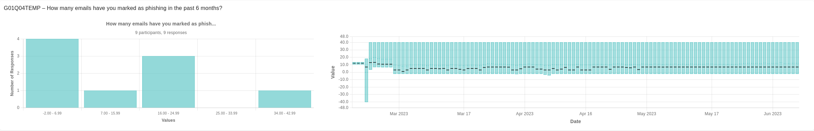

# Koord2ool Supported Question Types & Visualizations

This document details the LimeSurvey question types supported by Koord2ool and explains how each type is visualized in the application.

---

## Overview of Supported Question Types

Koord2ool supports the following LimeSurvey question types:

| LimeSurvey Question Type          | Timeline Chart | Active Data Chart |
|----------------------------------|----------------|-------------------|
| Yes/No (`yesno`)                 | Area           | Doughnut          |
| List Dropdown (`list_dropdown`)  | Area           | Doughnut          |
| Bootstrap Dropdown (`bootstrap_dropdown`) | Area     | Doughnut          |
| List Radio (`listradio`)         | Area           | Doughnut          |
| Numerical (`numerical`)          | Candlestick    | Histogram         |
| Multiple Short Text (`multipleshorttext`) | Area     | Wordcloud          |
| Multiple Choice (`multiplechoice`) | Area         | Doughnut          |

---

## **Area Charts (Timeline Visualization)**

**Used for:** Yes/No, List Dropdown, Bootstrap Dropdown, List Radio, Multiple Short Text, and Multiple Choice questions  

### **Visualization Details**
- **Chart Type:** Stacked area chart  
- **Purpose:** Tracks changes in responses over time  
- **Displayed Data:** Response counts aggregated by type  

### **Graph Interpretation**
- **X-Axis:** Time (dates of responses)  
- **Y-Axis:** Response values or counts  
- **Lines:** Represent different answer choices  
- **Trends:** Show how responses change over time  

### **Tooltip Functionality**
- Displays exact response values for each time point  
- Shows participant information when hovering over data points  
- Helps identify fluctuations or response patterns  

### **Time Format Options**
- **Real:** Shows responses at actual timestamps  
- **Stepped:** Aggregates responses into configurable time intervals (1h, 6h, or 24h)  

---

## **Area Charts (Distribution Visualization)**

**Used for:** Multiple Short Text and Multiple Choice questions  

### **Visualization Details**
- **Chart Type:** Stacked area chart  
- **Purpose:** Tracks response distribution over time  
- **Displayed Data:** Relative proportions of response options  

### **Graph Interpretation**
- **X-Axis:** Time (dates of responses)  
- **Y-Axis:** Counts or percentages  
- **Colored Areas:** Represent different response options  
- **Total Height:** Represents total number of responses at each point  

### **Tooltip Functionality**
- Displays response breakdown at a given time  
- Highlights trends in response popularity  

---

## **Numerical Questions (`numerical`)**

Numerical input questions are visualized using two chart types in Koord2ool: **Candlestick charts** for timeline-based trends and **Histograms** for active response distributions.

---

### **Timeline Chart: Candlestick Chart**

- **Chart Type:** Candlestick  
- **Purpose:** Visualize changes, spread, and trends in numerical values over time  
- **X-Axis:** Time (per day)  
- **Y-Axis:** Value range (dynamically scaled per dataset)  

#### **Displayed Data per Day**
- **Open:** First response value of the day  
- **Close:** Last response value of the day  
- **High:** Maximum value of the day  
- **Low:** Minimum value of the day  
- **Median:** Middle value of the sorted daily values  
- **Average:** Mean of all active responses  
- **Count:** Number of active responses for the day  

#### **How It Works**
- **Response Filtering:** Only responses marked as *active* on a given date are included (based on expiration window)  
- **Grouping:** Responses are grouped by day  
- **Aggregation:** For each day, values are sorted and used to compute open, close, min, max, median, and average  
- **Visualization:**  
  - Candlestick body shows open-to-close range  
  - Wicks show min-to-max range  
  - Median is marked with a horizontal line  
  - Average is shown as a dashed overlay line  

#### **Tooltip Functionality**
- Full statistical breakdown for each day:
  - Range, median, average, open, close  
  - Number of participants  
  - List of participant names (if enabled)

---

### **Active Data Chart: Histogram**

- **Chart Type:** Bar chart histogram  
- **Purpose:** Show distribution of *currently active* numerical responses  
- **X-Axis:** Value ranges (bins)  
- **Y-Axis:** Number of responses per bin  

#### **How Bins Are Created**
1. **Collect Responses:** Latest active numeric value per participant  
2. **Determine Range:** From minimum to maximum value  
3. **Calculate Bin Width:**
   - Uses **Freedman–Diaconis rule** (based on interquartile range and sample size)  
   - Adjusts number of bins for clarity  
4. **Label Bins:** Each bin is labeled with a value range (e.g., `12.0 – 15.9`)  
5. **Assign Counts:** Responses are placed into the correct bins based on their value  

#### **Tooltip Functionality**
- Displays for each bin:
  - Range label  
  - Number of responses  
  - Percentage of total responses

## **Doughnut Charts (Active Data)**

**Used for:** Current state analysis of Yes/No, List, and Multiple Choice questions  

### **Visualization Details**
- **Chart Type:** Doughnut chart  
- **Purpose:** Shows current distribution of responses  
- **Displayed Data:** Only the most recent (active) responses per participant  

### **Graph Interpretation**
- **Segments:** Different response options  
- **Segment Size:** Proportion of respondents who selected each option  
- **Colors:** Consistent with timeline visualizations for easy cross-reference  

### **Displayed Information**
- Shows count for each response option  
- Displays proportional representation of the current response state  

---

## **Free Text Questions (`shorttext`, `longtext`)**

Koord2ool supports two complementary views for analyzing free-text data:

| Chart Type        | Context        | Description                                |
|-------------------|----------------|--------------------------------------------|
| Word Cloud        | Active Data    | Highlights most frequent keywords          |
| Scatter Chart     | Timeline       | Shows when responses were submitted        |

### **Word Cloud (Active Data)**

- **Chart Type:** Word cloud  
- **Purpose:** Highlight recurring terms in current responses  
- **Displayed Data:** Top words extracted from currently active responses, with language-specific stopwords removed  
- **Word Size:** Indicates how often a word appears  
- **Colors:** Aid in visual grouping and readability  
- **Interactivity:** Click a word to open a tooltip showing:
  - How many times the word appears  
  - Up to 3 sample responses using the word  
  - A note if more responses are available  

This view helps quickly identify recurring themes and frequently mentioned terms.

---

### **Scatter Chart (Timeline Visualization)**

- **Chart Type:** Scatter chart  
- **Purpose:** Show when individual text responses were submitted  
- **Displayed Data:** Each point is a single text response with a timestamp  
- **X-Axis:** Time  
- **Y-Axis:** Participant index or response order  
- **Tooltip:** Displays full response text, timestamp, and participant info

**Used for:** Open-ended text response questions  

Koord2ool provides two complementary visualizations for free text data:

| Chart Type        | Context        | Description                                |
|-------------------|----------------|--------------------------------------------|
| Word Cloud        | Active Data    | Highlights most frequent keywords          |
| Scatter Chart     | Timeline       | Shows when responses were submitted        |

---

### **Visualization Details**
- **Chart Type:** Word cloud  
- **Purpose:** Highlight the most frequent keywords from recent participant responses  
- **Displayed Data:** Top words extracted from currently active responses, with stopwords removed based on selected languages  

### **Graph Interpretation**
- **Word Size:** Represents frequency — larger words appear more often  
- **Colors:** Aid in visual grouping and distinction  
- **Layout:** Dynamically positioned to maximize readability and avoid overlap  

### **Tooltip & Interaction Functionality**
- **Click a word** to view a tooltip showing:
  - The number of times the word appears  
  - Up to 3 full-text responses that include the word  
  - A note if more responses are available  

This view helps surface common themes and frequently mentioned terms at a glance.

---

### **2. Scatter Chart (Timeline Visualization)**

### **Visualization Details**
- **Chart Type:** Scatter chart with data points  
- **Purpose:** Track when responses were submitted  
- **Displayed Data:** Response timestamps with text content in tooltips  

### **Graph Interpretation**
- **X-Axis:** Time (dates of responses)  
- **Y-Axis:** Response count or participant identifier  
- **Points:** Individual text responses (shown as circles)  

### **Tooltip Functionality**
- Displays the full text response  
- Shows submission timestamp and participant information  

## **Settings and Customizations**

### **Time Format Options**
1. **Real Time Format:** Uses exact timestamps for precise response tracking  
2. **Stepped Time Format:** Groups responses into time intervals (1, 6, or 24 hours)  

### **Display Options**
- **Show/Hide N/A:** Toggle visibility of missing responses  
- **Active Answers Only:** Display only the latest response per participant  
- **Expiration Time:** Set how long responses remain "active" (1 day to 1 year)  

### **Chart Appearance**
- Consistent color scheme across all chart types  
- Responsive design that adapts to different screen sizes  
- Interactive tooltips providing detailed information  

---

## **Chart Card Layout**

Each question in Koord2ool is displayed in a card layout featuring:

1. **Left Section:** Question details and response counts  
2. **Middle Section:**  
   - Doughnut chart for categorical questions (Yes/No, List, Multiple Choice)  
   - Histogram for numerical questions  
   - *Not used for free text questions*  
3. **Right Section:**  
   - Area chart for categorical questions (showing stacked responses over time)  
   - Scatter/Line chart for numerical questions (showing individual values over time)  
   - Scatter chart for free text responses (showing when responses were submitted)  
