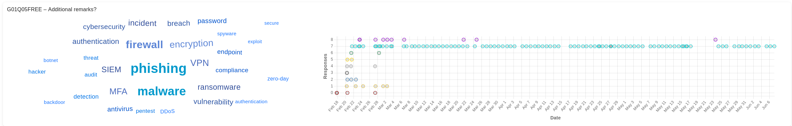

# Koord2ool Supported Question Types & Visualizations

This document details the LimeSurvey question types supported by Koord2ool and explains how each type is visualized in the application.

---

## Overview of Supported Question Types

Koord2ool supports the following LimeSurvey question types:

| LimeSurvey Question Type          | Timeline Chart | Active Data Chart |
|----------------------------------|----------------|-------------------|
| Yes/No (`yesno`)                 | Area           | Doughnut          |
| List Dropdown (`list_dropdown`)  | Area           | Doughnut          |
| Bootstrap Dropdown (`bootstrap_dropdown`) | Area     | Doughnut          |
| List Radio (`listradio`)         | Area           | Doughnut          |
| Numerical (`numerical`)          | Candlestick    | Histogram         |
| Multiple Short Text (`multipleshorttext`) | Area     | Doughnut          |
| Multiple Choice (`multiplechoice`) | Area         | Doughnut          |

---

## **Area Charts (Timeline Visualization)**

**Used for:** Yes/No, List Dropdown, Bootstrap Dropdown, List Radio, Multiple Short Text, and Multiple Choice questions  

### **Visualization Details**
- **Chart Type:** Stacked area chart  
- **Purpose:** Tracks changes in responses over time  
- **Displayed Data:** Response counts aggregated by type  

### **Graph Interpretation**
- **X-Axis:** Time (dates of responses)  
- **Y-Axis:** Response values or counts  
- **Lines:** Represent different answer choices  
- **Trends:** Show how responses change over time  

### **Tooltip Functionality**
- Displays exact response values for each time point  
- Shows participant information when hovering over data points  
- Helps identify fluctuations or response patterns  

### **Time Format Options**
- **Real:** Shows responses at actual timestamps  
- **Stepped:** Aggregates responses into configurable time intervals (1h, 6h, or 24h)  

---

## **Area Charts (Distribution Visualization)**

**Used for:** Multiple Short Text and Multiple Choice questions  

### **Visualization Details**
- **Chart Type:** Stacked area chart  
- **Purpose:** Tracks response distribution over time  
- **Displayed Data:** Relative proportions of response options  

### **Graph Interpretation**
- **X-Axis:** Time (dates of responses)  
- **Y-Axis:** Counts or percentages  
- **Colored Areas:** Represent different response options  
- **Total Height:** Represents total number of responses at each point  

### **Tooltip Functionality**
- Displays response breakdown at a given time  
- Highlights trends in response popularity  

---

## **Numerical Data Visualizations**

**Used for:** Numerical input questions  

Koord2ool offers two visualization methods for numerical data:

### **1. Scatter/Line Chart (Timeline Visualization)**

_See Histogram image below for an example of how individual data points appear over time._

- **Chart Type:** Scatter/Line chart  
- **Purpose:** Track changes in numerical values and free text responses over time  
- **Displayed Data:**  
  - Shows individual data points across the time period  
  - Y-axis displays either numerical values or response counts  
  - X-axis shows dates  
  - Data points appear as dots or circles on the chart  

### **2. Histogram (Active Data)**

- **Chart Type:** Bar chart histogram  
- **Purpose:** Shows the distribution of numerical responses  
- **Displayed Data:** Responses grouped into bins  

### **Graph Interpretation (Histogram)**
- **X-Axis:** Numerical value ranges  
- **Y-Axis:** Number of responses per range  

### **How Bins are Created**
1. Responses are converted to numbers  
2. The range of values is analyzed (e.g., from -40 to 40°C)  
3. The range is divided into appropriate intervals (e.g., `-40–3`, `3–7`, `7–11`, `11–14`, `14–40`)  
4. Responses are counted within each range  
5. Bin labels show the range (e.g., `3–7`)  

### **Tooltip Functionality**
- Displays bin range (e.g., `3–7`, `7–11`)  
- Shows total response count in that bin  
- Shows percentage of total responses  
- For the candlestick chart: shows exact values and dates  

---

## **Doughnut Charts (Active Data)**

**Used for:** Current state analysis of Yes/No, List, and Multiple Choice questions  

### **Visualization Details**
- **Chart Type:** Doughnut chart  
- **Purpose:** Shows current distribution of responses  
- **Displayed Data:** Only the most recent (active) responses per participant  

### **Graph Interpretation**
- **Segments:** Different response options  
- **Segment Size:** Proportion of respondents who selected each option  
- **Colors:** Consistent with timeline visualizations for easy cross-reference  

### **Displayed Information**
- Shows count for each response option  
- Displays proportional representation of the current response state  

---

## **Free Text Visualization**

**Used for:** Free text response questions  

### **Visualization Details**
- **Chart Type:** Scatter chart with data points  
- **Purpose:** Track when responses were submitted  
- **Displayed Data:** Response timestamps with text content in tooltips  

### **Graph Interpretation**
- **X-Axis:** Time (dates of responses)  
- **Y-Axis:** Response count or participant identifier  
- **Points:** Individual text responses (shown as circles)  

### **Tooltip Functionality**
- Displays the full text response  
- Shows submission timestamp and participant information  

---

## **Settings and Customizations**

### **Time Format Options**
1. **Real Time Format:** Uses exact timestamps for precise response tracking  
2. **Stepped Time Format:** Groups responses into time intervals (1, 6, or 24 hours)  

### **Display Options**
- **Show/Hide N/A:** Toggle visibility of missing responses  
- **Active Answers Only:** Display only the latest response per participant  
- **Expiration Time:** Set how long responses remain "active" (1 day to 1 year)  

### **Chart Appearance**
- Consistent color scheme across all chart types  
- Responsive design that adapts to different screen sizes  
- Interactive tooltips providing detailed information  

---

## **Chart Card Layout**

Each question in Koord2ool is displayed in a card layout featuring:

1. **Left Section:** Question details and response counts  
2. **Middle Section:**  
   - Doughnut chart for categorical questions (Yes/No, List, Multiple Choice)  
   - Histogram for numerical questions  
   - *Not used for free text questions*  
3. **Right Section:**  
   - Area chart for categorical questions (showing stacked responses over time)  
   - Scatter/Line chart for numerical questions (showing individual values over time)  
   - Scatter chart for free text responses (showing when responses were submitted)  
